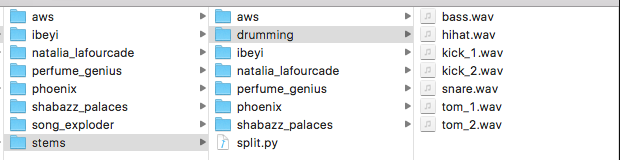
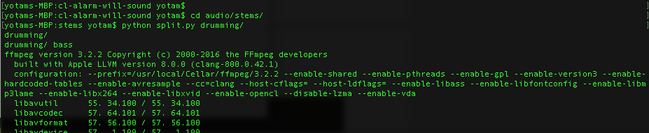
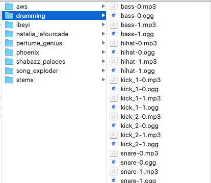
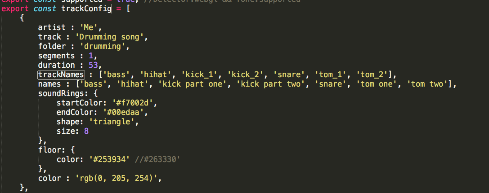

# Overview

Song Exploder Presents: Inside Music is a [WebVR Experiment](https://webvrexperiments.com) that lets you step inside a song, giving you a closer look at how music is made.

The audio of the featured artists and voice over is not included in this repo. To add your own audio and play it in this experiment follow the instructions below.

This is an Experiment, not a Google product.

## Technology

Inside Music is built with [aframe](https://aframe.io), [THREE.JS](https://threejs.org) and [Tone.js](https://tonejs.github.io/).

## Contributors

* [@hapticdata](https://github.com/hapticdata)
* [@tambien](https://github.com/tambien)
* [@ryburke](https://github.com/ryburke)
* [@alexanderchen](https://github.com/alexanderchen)

## Interaction

Select a song from the menu. The stems of the song will appear in a circle around you, each represented by a sphere. In _360 Mode_, tap the spheres to turn them on or off. In _VR Mode_, you can use your controller to toggle their state. On Google Cardboard, you will have a retical (a small circle in front of you eye) which can be used to turn the stems on and off.

## Build

To build a local version of Inside Music, you will need to have Node.js and [webpack](https://webpack.github.io/) installed.

In the terminal, inside the project's directory, install all of the project's dependencies:

```bash
npm install
```

Then compile the source code with webpack:

```bash
webpack -p
```

You can now run a local server such as `http-server`. To install `http-server`, run `npm install -g http-server`. You can now view the site in a browser.

NOTE: You'll have to add your own audio files for the experiment to work.

## Exploring your own music in VR

We hope this experiment inspires musicians and coders to explore their own music in VR. Here's a step-by-step guide to bringing your own music into VR, using the open-source code from the Inside Music experiment. The application supports anywhere from 1-7 stems.

### Preparing your stems

First, export the stems of your song as `wav` and so that they all line up at the beginning. Create a folder for your song in the `audio/stems` folder. For example our demo song is called 'drumming'.



Next, we need to use the `audio/stems/split.py` script to split each stem into 30 second chunks. This way it can stream more easily (getting around Web Audio's current streaming limitations). Once we run the script, it will split the audio files and move the generated files up one directory to the `audio` folder.

Dependencies: to run `split.py` make sure you have python installed as well as [pydub](https://github.com/jiaaro/pydub).

In the terminal, `cd` into the `audio/stems` folder. From there, run the `split.py` command with the name of your project's folder

This is what the output in the terminal looks like when I run `split.py` on my `drumming` folder



This will generate a bunch of 30 second files encoded both as mp3s and ogg files (ogg is only necessary to support Chromium browsers) and place those files into a folder with the same name in the `audio` folder



### Config

Open up [Config.js](./src/Config.js). This is where you will enter the styling and meta data necessary to run your song. There is a variable called `trackConfig` with an array of data corresponding to all 6 songs in the experience. Replace the details in one of the objects in that array with the info for your song as described below.

Start by replacing some of the basic data such as what you would like to appear under the 'artist' and 'track' listing. Now enter the name of your track's folder. Set the duration of your song (in seconds).

In the field called 'segments', enter the maximum number of segments for the tracks that `split.py` generated. You can see in the above picture, that since our song is short, the maximum segment value is "1". In the array called 'trackNames' within your tracks object, enter the name of each of the audio files. In the 'names' array, enter the name that you'd like those tracks to appear under. The names here should correspond to the order of 'trackNames'. If your track has fewer than 7 stems, you can put the string 'null' in the trackNames and 'names' arrays to indicate that there is no stem in that position.

You can now play around with some of the colors for the floor and particles.

This is what the config for our drumming song might look like:



You can now rebuild the javascript files by following the [build instructions above](#build) and explore your song in VR!

## LICENSE

Copyright 2017 Google Inc.

Licensed under the Apache License, Version 2.0 (the "License"); you may not use this file except in compliance with the License. You may obtain a copy of the License at

http://www.apache.org/licenses/LICENSE-2.0

Unless required by applicable law or agreed to in writing, software distributed under the License is distributed on an "AS IS" BASIS, WITHOUT WARRANTIES OR CONDITIONS OF ANY KIND, either express or implied. See the License for the specific language governing permissions and limitations under the License.
